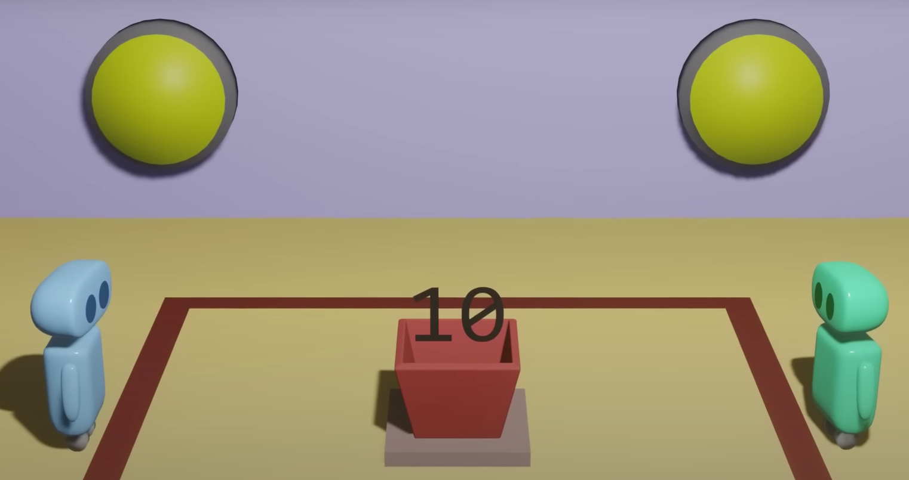

- [Program, Process, Thread](#program-process-thread)
- [Concurrency](#concurrency)
- [Parallel Execution](#parallel-execution)
- [Concurrent Parallel Execution](#concurrent-parallel-execution)
- [Parallelism](#parallelism)
- [Concurrency vs. Parallelism](#concurrency-vs-parallelism)
- [Thread Safety](#thread-safety)
- [Race Condition](#race-condition)
- [Deadlock](#deadlock)

### Program, Process, Thread

-   **Program**: A program is a set of instructions that a computer can execute to perform a specific task. It is a static sequence of instructions written in a programming language. When a program is loaded into memory and becomes a process, it can be executed.

-   **Process**: A process is an instance of a program that is being executed. It contains the program code and its current activity. Each process has a separate memory address space, which means that a process runs independently and is isolated from other processes. It cannot directly access shared data in other processes. Switching from one process to another requires some time for saving and loading registers, memory maps, and other administrative information Has own code segment, data segment, heap, stack, registers.

-   **Thread**: A thread is the smallest unit of execution within a process. A process can have multiple threads. Each thread within the process shares the same data space with the entire process, so they can communicate with each other more easily than if they were separate processes. Threads are sometimes called lightweight processes and they do not require much overhead to create and manage. Has own stack, registers. Code segment, data segment, heap are used from the process.

### Concurrency

Concurrency means executing multiple tasks at the same time but not necessarily simultaneously. There are two tasks executing concurrently, but those are run in a 1-core CPU, so the CPU will decide to run a task first and then the other task or run half a task and half another task, etc. Two tasks can start, run, and complete in overlapping time periods i.e Task-2 can start even before Task-1 gets completed. It all depends on the system architecture.

The switching among tasks happens so fast that a user can't notice in blank eye therefore it seems the computer is making progress on more than one task concurrently. In reality, it is just context switching.

### Parallel Execution

Parallel execution refers to the concept of executing multiple tasks or processes simultaneously. This is made possible by systems with multiple processors or cpu cores.

### Concurrent Parallel Execution

Combination of Concurrency and Parallel Execution. For example, Among 4 tasks, task 1 and 2 are running concurrently in cpu 1, task 3 and 4 are running concurrently in cpu 2.

### Parallelism

Parallelism means that an application splits its tasks up into smaller subtasks which can be processed in parallel. Parallelism requires hardware with multiple processing units, essentially. In single-core CPU, you may get concurrency but NOT parallelism. Parallelism is a specific kind of concurrency where tasks are really executed simultaneously.

### Concurrency vs. Parallelism

A system is said to be concurrent if it can support two or more actions in progress at the same time. A system is said to be parallel if it can support two or more actions executing simultaneously.

The key concept and difference between these definitions is the phrase “in progress.”

This definition says that, in concurrent systems, multiple actions can be in progress (may not be executed) at the same time. Meanwhile, multiple actions are simultaneously executed in parallel systems. In fact, concurrency and parallelism are conceptually overlapped to some degree, but “in progress” clearly makes them different.

Concurrency is about dealing with lots of things at once. Parallelism is about doing lots of things at once.

### Thread Safety

Thread safety ensures only one thread will work with a piece of code that has side effects like data mutation.

### Race Condition

A race condition is a situation in concurrent programming where two or more threads can access shared data and they try to change it at the same time. As a result, the values of variables may be unpredictable and vary depending on the timings of context switches of the processes.

To prevent race conditions, you typically need to synchronize threads to ensure that only one thread can access the shared data at a time. This can be done using various synchronization techniques, such as mutexes and semaphores.

### Deadlock

A deadlock is a situation in concurrent programming where two or more tasks are unable to proceed because each is waiting for the other to release a resource.

For example, consider two tasks, A and B, and two resources, 1 and 2. Suppose task A holds resource 1 and needs resource 2 to complete, while task B holds resource 2 and needs resource 1 to complete. Neither task can proceed, because each is waiting for the other to release a resource. This situation is a deadlock.

Dekker's algorithm is a concurrency control protocol for mutual exclusion on a critical section of code. It allows two threads to share a single-use resource without conflict, using only shared memory for communication.

Both process is waiting for other to complete. At the same time, both of them expressing intent to enter the critical section(red area) which will never end.

Dekker's algorithm is specifically designed for two processes. If you have more than two processes (or "nodes"), you can't directly use Dekker's algorithm. The algorithm relies on the concept of "turns" between two processes to ensure mutual exclusion, and this concept doesn't scale well for more than two processes.

For N number of processes, you would need to use more complex synchronization mechanisms. Here are a few examples:

-   **Semaphores**: A semaphore is a higher-level synchronization primitive that can be used to control access to a critical section from multiple processes. A semaphore maintains a count of available resources, and processes must acquire the semaphore before entering the critical section and release it when they're done.

-   **Monitors**: A monitor is a synchronization construct that allows threads to have both mutual exclusion and the ability to wait (block) for a certain condition to become true. Monitors also have a mechanism for signaling other threads that their condition has been met.

-   **Locks**: Most modern programming languages provide built-in support for locks (also known as mutexes), which can be used to ensure that only one thread at a time can access a critical section.

Remember, the choice of synchronization mechanism depends on the specific requirements of your system and the nature of the shared resources that need to be accessed concurrently.
